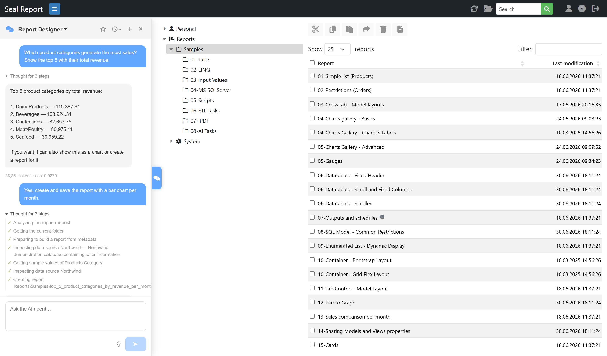
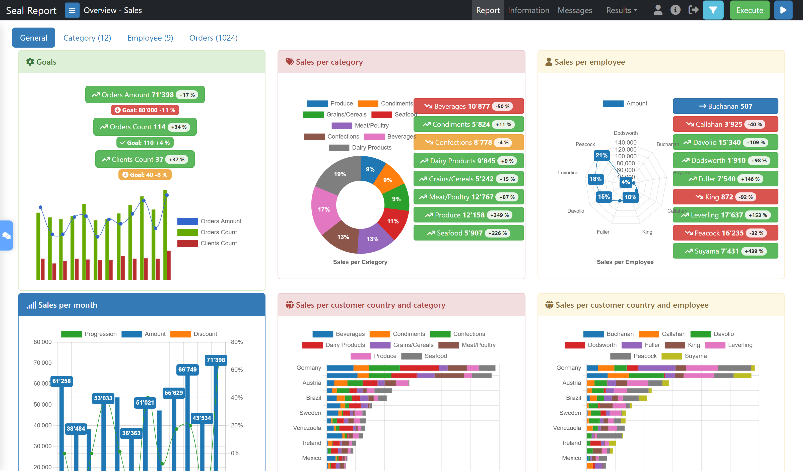
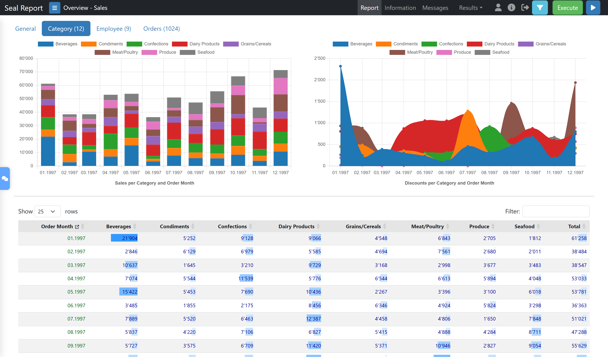
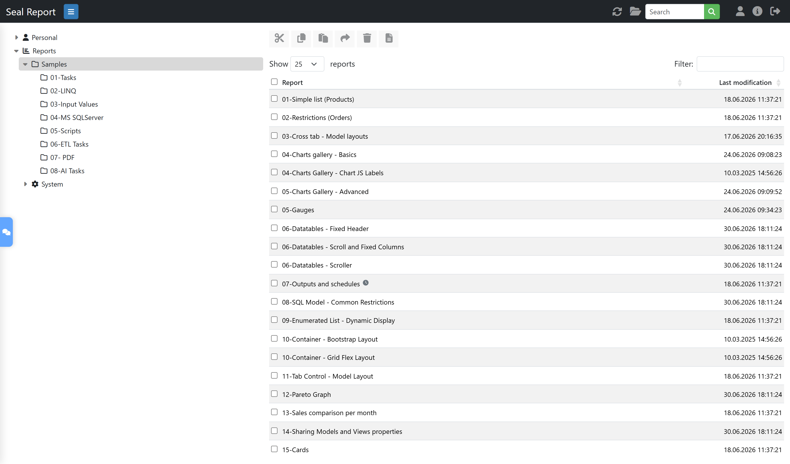
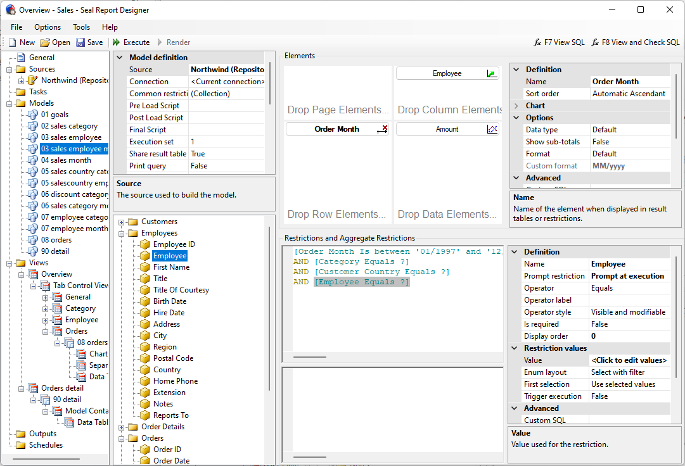

# Seal Report & Task

<a href="https://sealreport.org" target=_blank>Seal Report & Task</a> is a complete **open source** framework
for producing reports from any database or NoSQL source, and for performing complex tasks (ETL, batch).
Entirely written in C# for Microsoft .NET, and **free for everyone under the [MIT License](LICENSE)**.

The product focuses on **easy installation** and **report design**: once set up, reports can be built
and published in a minute.

* **Web site & quick start guides**: <a href="https://sealreport.org" target=_blank>sealreport.org</a>
* **Live demo** of the Web Report Server: <a href="https://sealreport.org/demo" target=_blank>sealreport.org/demo</a>
* **Free support & community**: <a href="https://github.com/ariacom/Seal-Report/discussions" target=_blank>GitHub Discussions</a>

## Main Features
* **Dynamic SQL sources**: Use your own SQL, or let the Seal engine build the SQL used to query your database dynamically.
* **LINQ queries**: Join and query any data sources (SQL, Excel, XML, OLAP Cube, HTTP JSON, etc.) with the power of LINQ.
* **Native Pivot Tables**: Drag and drop elements directly in a pivot table (cross tab) and display them in your report.
* **HTML5 Charts**: Define and display chart series in two mouse clicks (support of ChartJS, ECharts, Plotly, ScottPlot and Gauge libraries).
* **AI Agents**: Chat with role-based AI agents to design reports, analyze data, manage data sources, schedule executions or administer the server — using your own provider (OpenAI, Azure OpenAI, Anthropic or Ollama, including local models). AI tasks can also be embedded in reports.
* **Fully responsive HTML rendering with the Razor engine**: Use the power of HTML5 in the report result (Bootstrap layout, responsiveness, table sorting and filtering). Customize your report presentation in HTML with Razor parsing.
* **Excel and PDF**: Full control of your report result in Excel (EPPlus library) or PDF (QuestPDF library). Several other formats are available (XML, JSON, Text, CSV) or can easily be customized.
* **KPI and Widget Views**: Create and display your Key Performance Indicators in a single report.
* **Web Report Server**: Publish your reports on the web (Windows and Linux with .NET).
* **Report Scheduler**: Schedule report executions and generate results in folders, FTP/SFTP servers or SharePoint document libraries, or send them by email (SMTP, SendGrid or MS Graph) — integrated with the Windows Task Scheduler or available as a service.
* **Drill down navigation and sub-reports**: Navigate in your report result to drill to a detail or to execute another report.
* **Report Tasks & ETL**: Define tasks to perform your ETL or batch operations (data load, Excel load, file download from FTP or SFTP, zip, backup, data processing, etc.) or to trigger procedures from external assemblies.
* **Native support of MongoDB**.
* **NuGet packages** to ease integration into existing projects.
* **Low TCO (total cost of ownership)**: Designed for minimal ongoing maintenance.

## Quick Start
1. **Install**: Download the latest setup from <a href="https://sealreport.org" target=_blank>sealreport.org</a> or the <a href="https://github.com/ariacom/Seal-Report/releases" target=_blank>GitHub Releases</a>.
2. **Connect**: Use the Server Manager to declare a data source (OLE DB, ODBC, MS SQL Server, Oracle, MySQL, SQLite, PostgreSQL, MongoDB, Excel, CSV, ...).
3. **Design**: Build your first report in the Report Designer — drag elements, add restrictions, choose charts — or let the AI assistant create it for you.
4. **Publish**: Deploy the Web Report Server (Windows or Linux) and schedule your report outputs.

Step-by-step tutorials are available at <a href="https://sealreport.org" target=_blank>sealreport.org</a>.

## Screen Shots
### AI Agents
Ask an agent in plain language: it inspects your data sources, answers with the data, then builds and saves the report for you.

### HTML Report Result

### Web Report Server

### Report Designer

## System Requirements
**For use:**
* .NET 10.0 (Microsoft Windows Desktop Runtime 10)
* Database drivers: OLE DB, ODBC, MS SQL Server, Oracle, MySQL, SQLite, PostgreSQL, MongoDB
* For the Report Designer: Microsoft Edge WebView2
* For the Web Report Server: Internet Information Server with ASP.NET Core Runtime 10 (Hosting Bundle), or Linux with the ASP.NET Core Runtime

**For development:**
* Visual Studio 2026

## License
Seal Report is free and open source for everyone under the **[MIT License](LICENSE)**.

Third-party components are distributed under their own licenses, see [THIRD-PARTY-NOTICES.md](THIRD-PARTY-NOTICES.md) (in particular QuestPDF if your own code calls its APIs directly).

## Supporting Seal Report
Seal Report is an open-source project maintained by **Ariacom**.  
You can support its development and sustainability in several ways.
- **Give a star**: It is free and takes one click — starring the repository increases the product visibility and helps the community grow. ⭐
- **Contribute**: Bug reports, documentation, translations or code — see [CONTRIBUTING.md](CONTRIBUTING.md) to get started.
- **Support subscription**: The simplest way to support the product is to subscribe to professional support at [Seal Report Services](https://sealreport.com).
- **Consulting**: If you require professional consulting, training, or workshops, please contact [Ariacom](https://ariacom.com).
- **Sponsoring new features**: If you need a new feature that could also benefit the community and become part of future product releases, you may sponsor its development. Contact us at [Ariacom](https://ariacom.com).
